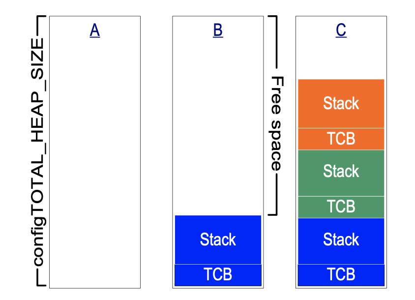
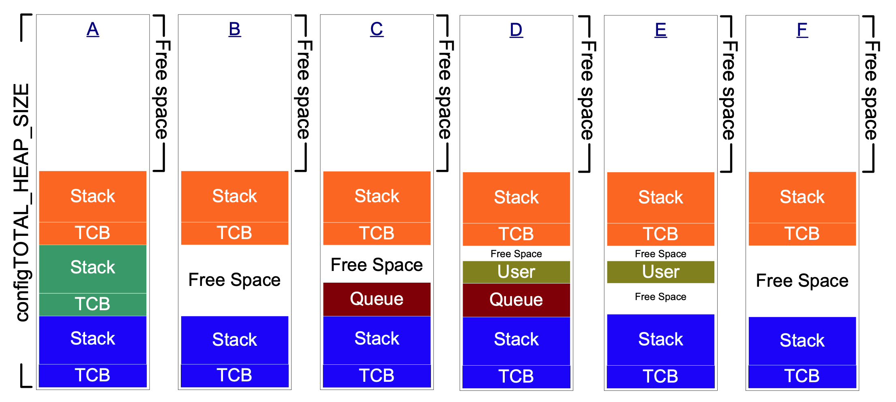

# FreeRTOS

## Memory Manage (heap)

FreeRTOS 五种内存分配策略 

`FreeRTOS/Source/portable/MemMang`

`heap_1.c, heap_2.c, heap_3.c, heap_4.c, heap_5.c`

堆(数组)大小的定义: `FreeRTOSConfig.h`

`#define configTOTAL_HEAP_SIZE xxx`

每个创建的任务会在堆上创建一个任务控制快(TCB)和一个调用堆栈.



### heap_1.c

堆大小: `configTOTAL_HEAP_SIZE`

实现了一个基础功能的`pvPortMalloc()`, 不实现`vPortFree()`.

(创建任务后不删除任务的项目)

### heap_2.c

兼容老项目, 新项目使用`heap_4.c`

### heap_3.c

使用标准库的`malloc()`和`free()`函数.

线程安全: 暂停调度器.

heap_size: 链接器决定(configTOTAL_HEAP_SIZE不起作用)

### heap_4.c

堆大小: `configTOTAL_HEAP_SIZE`

分配方法: First fit algorithm



自定义堆地址(`configAPPLICATION_ALLOCATED_HEAP`)

`#define configAPPLICATION_ALLOCATED_HEAP 1`

gcc:
`uint8_t ucHeap[configTOTAL_HEAP_SIZE] __attribute__ ((section(".my_heap")));`

### heap_5.c

可以设置多个堆(与`heap_4.c`不同).

分配方法: First fit algorithm

设置堆地址 API:

```c
typedef struct HeapRegion
{
    /* The start address of a block memory that will be part of the heap.*/
    uint8_t *pucStartAddress;

    /* The size of the block of memory in bytes.*/
    size_t xSizeInBytes;
} HeapRegion_t;

void vPortDefineHeapRegions(const HeapRegion_t * const pxHeapRegions);
```

### Heap 相关 API

```c
size_t xPortGetFreeHeapSize( void );
size_t xPortGetMinimumEverFreeHeapSize( void );

#define configUSE_MALLOC_FAILED_HOOK 1
void vApplicationMallocFailedHook( void );
```

