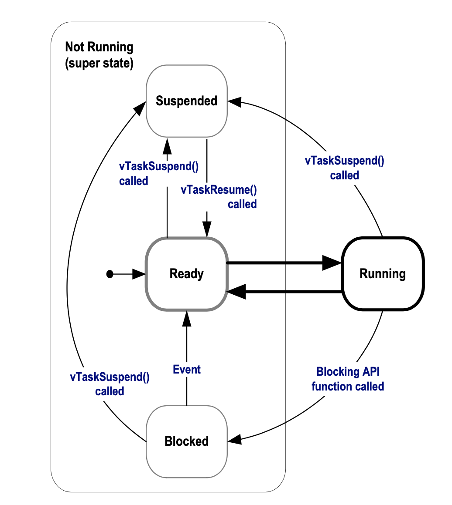

# FreeRTOS

## Memory Manage (heap)

FreeRTOS 五种内存分配策略 

`FreeRTOS/Source/portable/MemMang`

`heap_1.c, heap_2.c, heap_3.c, heap_4.c, heap_5.c`

堆(数组)大小的定义: `FreeRTOSConfig.h`

`#define configTOTAL_HEAP_SIZE xxx`

每个创建的任务会在堆上创建一个任务控制快(TCB)和一个调用堆栈.


### heap_1.c

堆大小: `configTOTAL_HEAP_SIZE`

实现了一个基础功能的`pvPortMalloc()`, 不实现`vPortFree()`.

(创建任务后不删除任务的项目)

### heap_2.c

兼容老项目, 新项目使用`heap_4.c`

### heap_3.c

使用标准库的`malloc()`和`free()`函数.

线程安全: 暂停调度器.

heap_size: 链接器决定(configTOTAL_HEAP_SIZE不起作用)

### heap_4.c

堆大小: `configTOTAL_HEAP_SIZE`

分配方法: First fit algorithm


自定义堆地址(`configAPPLICATION_ALLOCATED_HEAP`)

`#define configAPPLICATION_ALLOCATED_HEAP 1`

gcc:
`uint8_t ucHeap[configTOTAL_HEAP_SIZE] __attribute__ ((section(".my_heap")));`

### heap_5.c

可以设置多个堆(与`heap_4.c`不同).

分配方法: First fit algorithm

设置堆地址 API:

```c
typedef struct HeapRegion
{
    /* The start address of a block memory that will be part of the heap.*/
    uint8_t *pucStartAddress;

    /* The size of the block of memory in bytes.*/
    size_t xSizeInBytes;
} HeapRegion_t;

void vPortDefineHeapRegions(const HeapRegion_t * const pxHeapRegions);
```

### Heap 相关 API

```c
size_t xPortGetFreeHeapSize( void );
size_t xPortGetMinimumEverFreeHeapSize( void );

#define configUSE_MALLOC_FAILED_HOOK 1
void vApplicationMallocFailedHook( void );
```

## Task Management

### 创建任务

```c
/*
 * pvTaskCode: Task Function pointer
 * 
 * #define configMAX_TASK_NAME_LEN xxx
 * pcName: A descriptive name for the task. (For debugging aid)
 * 
 * usStackDepth: e.g. 100, 32-bits cpu, ( = 100 * 4 bytes ) 
 *
 * pvParameters: pass to task
 *
 * #define configMAX_PRIORITIES xxx
 * uxPriority: 0 - configMAX_PRIORITIES-1 (low - high)
 * 
 * pxCreatedTask: task handle
 *
 * Returned value: 1. pdPASS 2. pdFAIL
 */
BaseType_t xTaskCreate( TaskFunction_t pvTaskCode,
                        const char * const pcName,
                        uint16_t ucStackDepth,
                        void *pvParameters,
                        UBaseType_T uxPriority,
                        TaskHandle_t *pxCreatedTask);
```

### Example 1. Creating tasks

```c
void vTask1( void *pvParameters )
{
    const char *pcTaskName = "Task 1 is running\r\n";
    volatile uint32_t ul;  // volatile to ensure ul is not optimized away.

    for ( ;; )
    {
        vPrintString( pcTaskName )

        // delay
        for ( ul = 0; ul < mainDELAY_LOOP_COUNT; ul++ ) 
        {

        }
    }
}

int main( void )
{
    xTaskCreate( vTask2, "Task 2", 1000, NULL, 1, NULL );

    vTaskStartScheduler();

    for ( ;; );
}
```

### Example 2. Using the task parameter

```c
void vTaskFunction( void *pvParameters )
{
    char *pcTaskName;
    volatile uint32_t ul;

    pcTaskName = ( char * ) pvParameters;

    for ( ;; )
    {
        vPrintString( pcTaskName );
        for (ul = 0; ul < mainDELAY_LOOP_COUNT; ul++)
        {

        }
    }
}

static const char *pcTextForTask1 = "Task1 is running\r\n";
static const char *pcTextForTask2 = "Task2 is running\r\n";

int main()
{
    xTaskCreate(vTaskFunction, "Task 1", 1000, (void*)pcTextForTask1, 1, NULL);
    xTaskCreate(vTaskFunction, "Task 2", 1000, (void*)pcTextForTask2, 1, NULL);

    vTaskStartScheduler();

    for (;;);
}
```

### Task states



### Block task with delay

```c
/*
 * xTicksToDelay: ticks (e.g. pdMS_TO_TICKS(100) - 100ms)
 */
void vTaskDelay( TickType_t xTicksToDelay );
```